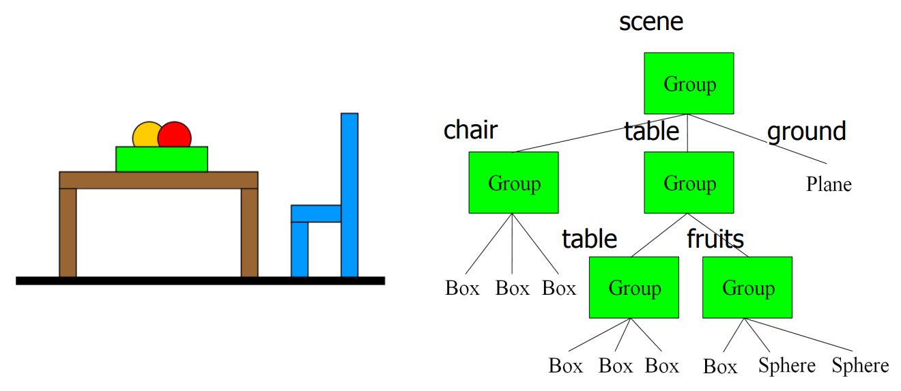

# Introduction to Hierarchical Structures

**Hierarchical structures** are fundamental in computer graphics and animation for organizing objects into levels of control. In such structures, higher-level nodes dictate the transformations and movements of lower-level nodes. This hierarchical organization is akin to a parent-child relationship, where changes at the parent level cascade down to affect the children.

## Matrix Transformations and Their Role

**Matrix transformations**, including translation (movement), rotation, and scaling, are pivotal in positioning and orienting objects in 3D space. These transformations are represented mathematically and applied to objects' vertices to achieve desired spatial arrangements.

## Application in Articulated Arm Models

### Constructing a Hierarchical Model

In an articulated arm model:

- **Root Node**: Typically represents the base or starting point of the arm structure, such as the Shoulder.
- **Child Nodes**: These are parts of the arm connected hierarchically, like the Elbow, Forearm, Wrist, and Palm.
  
Each part's position and orientation are determined relative to its parent node through matrix transformations.

### Understanding Transformation Hierarchy

- **Shoulder as the Root**: At the top of the hierarchy, the Shoulder controls the entire arm assembly. Movements or transformations applied to the Shoulder propagate down through the arm structure.

- **Effect of Shoulder Movement**: When the Shoulder moves, it influences the positions and orientations of the Elbow, Forearm, Wrist, and Palm. This hierarchical flow ensures that changes at the top level affect all connected parts.

- **Lower-Level Nodes**: Parts like the Wrist and Palm, positioned further down the hierarchy, have limited influence. Moving the Wrist, for example, affects only the Palm directly connected to it, without altering the higher-level components like the Shoulder or Elbow.

### Example: Human Body Articulation

Consider the human body as an analogy:

- **Torso**: Acts as the root node, influencing the positioning of limbs (arms and legs).
- **Arms and Legs**: Child nodes controlled by the Torso, allowing coordinated movement.
- **Fingers and Toes**: Lower-level nodes controlled by the hands and feet, independently articulating without affecting higher-level movements.

Let's Understand through another example-

## Hierarchical Grouping of Objects

The image presents a scene with a table, a chair, and a ground plane. These objects are then further broken down into smaller components, revealing a hierarchical structure. This hierarchical representation is common in computer graphics and 3D modeling to manage and organize complex scenes.

 
[Source: MIT Lectures]

**Scene Breakdown:**

1. **Scene:**
   - The root of the hierarchy.
   - Contains three main groups:
     - **Chair:** A single chair object.
     - **Table:** A table with a table top and legs.
     - **Ground:** A flat plane representing the ground.

2. **Chair:**
   - A group containing three sub-groups:
      - **Leg1:** A box object representing one leg of the chair.
      - **Leg2:** A **larger** box object representing the **back leg** of the chair.
      - **Seat:** A box object representing the sitting surface of the chair.

3. **Table:**

   - A group containing two sub-groups:
      - **Table:** 
         - A group containing 3 sub-groups:
            - **Table Top:** A rectangular box representing the table surface.
            - **2-Legs:** A group containing two box objects representing the table legs. 

      - **Fruits on the Table:**:A group containing two sub-groups:
        - **Box:** A group of three box objects, likely representing boxes or containers.
        - **Spheres:** A group of two sphere objects, representing the fruits.

4. **Ground:**
   - A single plane object, likely a large flat surface.

 

**Additional Notes:**

- The use of groups allows for efficient organization and manipulation of objects within a scene. For example, if you want to move the entire table, you only need to move the "Table" group, which will automatically move all its child objects (table top and legs).
- This hierarchical structure is often used in 3D modeling software and game engines to create and manage complex scenes with many objects.

**In essence, the image showcases a basic hierarchical structure commonly used in 3D graphics to organize and represent objects within a scene. It demonstrates how larger objects can be composed of smaller objects, and how groups can be used to efficiently manage and manipulate these objects.**

